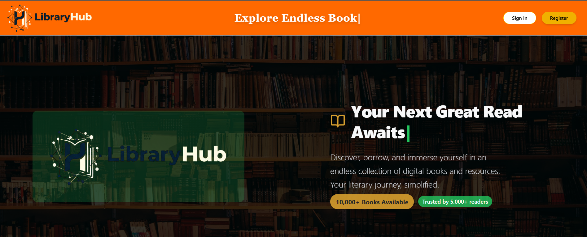
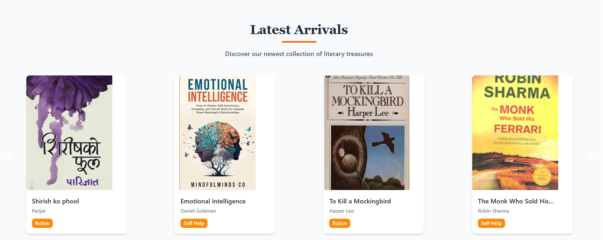
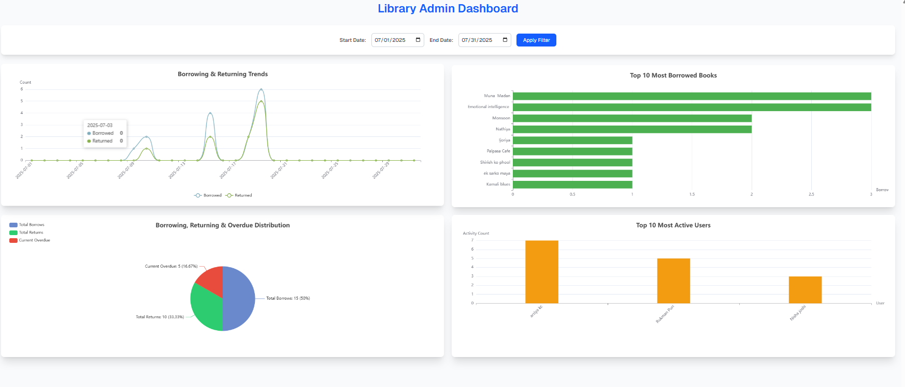
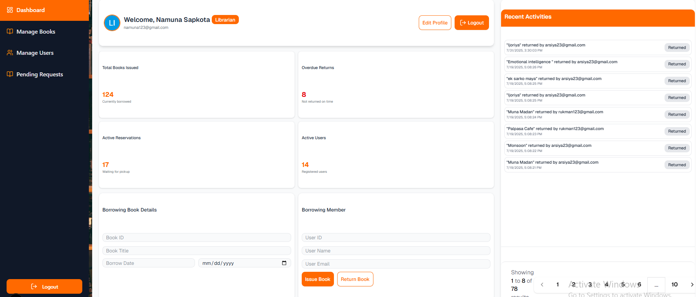
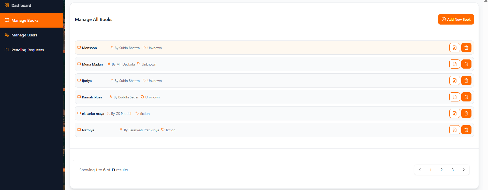
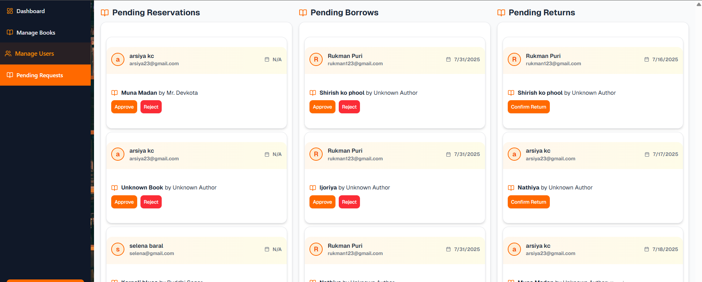
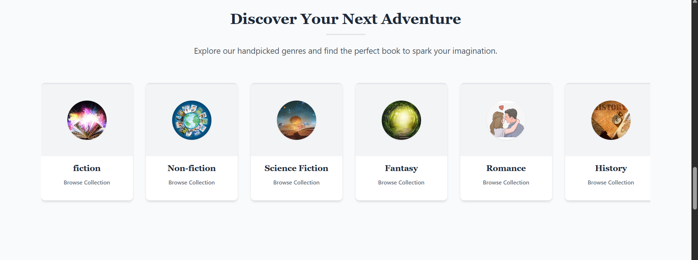
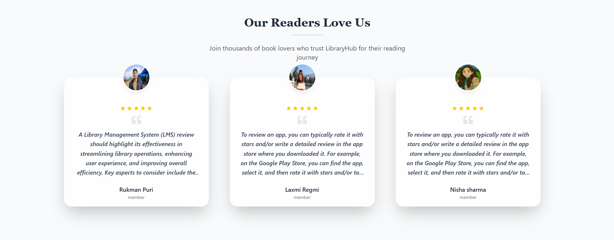
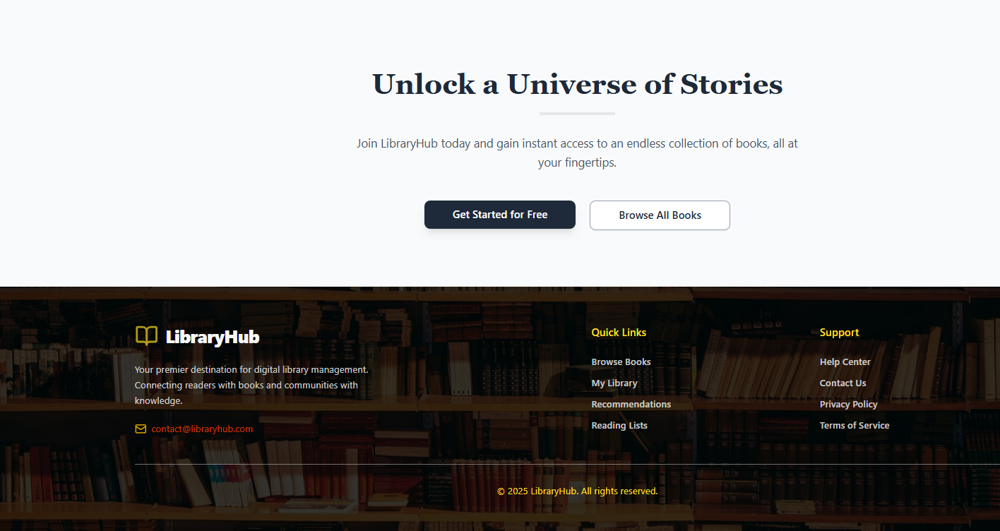
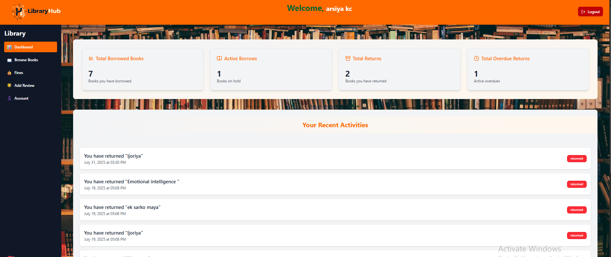

# LibraryConnect

---

## Table of Contents

* [About](#about)
* [Features](#features)
* [Technology Stack](#technology-stack)
* [Project Phases & Progress](#project-phases--progress)
* [Getting Started](#getting-started)
* [Contact](#contact)

---

## About

LibraryConnect is a modern, MERN stack-based Library Management System designed to streamline library operations and enhance the experience for administrators, librarians, and members. Our mission is to provide an efficient and intuitive platform for managing books, users, and borrowing activities, making libraries more accessible and organized.

---

## Features

### Core Features

* **Role-Based Access Control**: Differentiated access for Admins, Librarians, and Members with specific functionalities for each role.
* **User & Role Management**: Admins can manage user accounts and assign roles (Admin, Librarian, Member).
* **Book Management**: Comprehensive CRUD operations (Create, Read, Update, Delete) for books by Librarians and Admins.
* **Book Issuance & Return**: Librarians can easily issue and record the return of books.
* **Book Reservation System**: Members can request and reserve available books.
* **Borrowing History**: Members can view their complete borrowing history.
* **Search & View Books**: Members can search and view available books in the library catalog.
* **Reporting & Analytics**: Admins can view various reports related to library activities.
* **Dashboard Views**: Tailored dashboards for Librarians to view key metrics and ongoing activities.

---

## Technology Stack

LibraryConnect is built using the following technologies:

### Frontend

* **Next.js**: React framework for production with server-side rendering and static site generation.
* **App Router**: Next.js's new routing paradigm for building performant and scalable applications.
* **Shadcn UI**: Beautifully designed components built with Radix UI and Tailwind CSS.
* **Formik**: For building forms in React, handling form state, validation, and submission.
* **Yup**: Schema builder for value parsing and validation.
* **Axios**: Promise-based HTTP client for making API requests.
* **Redux**: Predictable state container for JavaScript apps, used for global state management.

### Backend

* **Node.js**: JavaScript runtime environment.
* **Express.js**: Fast, unopinionated, minimalist web framework for Node.js.
* **Mongoose**: MongoDB object data modeling (ODM) for Node.js, providing a straightforward, schema-based solution for modeling application data.
* **bcrypt**: Library to help you hash passwords.
* **jsonwebtoken (JWT)**: For implementing secure authentication by generating and verifying tokens.

### Database

* **MongoDB**: A NoSQL, document-oriented database.

---

## Project Phases & Progress

I am  developing LibraryConnect in distinct phases to ensure a robust and feature-rich application.

### Phase 1: Core Authentication & Admin Powerhouse (Currently Completed & Enhanced)

**Goal**: Establish a secure foundation with comprehensive user authentication and empower administrators with full control.

* **Frontend**:
    * ✅ Implemented **User Login** page.
    * ✅ Implemented **User Register** page.
    * ✅ Basic **Logout** functionality.
    * ✅ **Admin Dashboard**: Fully functional interface for managing users and roles.
    * ✅ API integration (GET, POST, PUT, DELETE) for **Admin tasks** (e.g., managing users, assigning roles).
    * ✅ **Redux Setup** for managing authentication and admin-related states.
* **Backend**:
    * ✅ **User Registration Endpoint**: Allows new users to sign up, checks for existing emails, hashes passwords securely using **bcrypt**, and creates new user entries.
    * ✅ **User Login Endpoint**: Authenticates users, verifies email and password with **bcrypt**, and generates a **JWT** upon successful login.
    * ✅ **Role-based Authorization Middleware**: Ensures only authorized users can access specific routes.
    * ✅ **Admin-specific Endpoints**: Fully functional endpoints for managing users (CRUD), assigning roles, and viewing system-wide reports.

### Phase 2: Librarian's Command Center & Book Circulation (In Progress)

**Goal**: Equip librarians with the tools to manage the book catalog and handle day-to-day book issuance and returns.

* **Frontend**:
    * ✅ Librarian Dashboard interface.
    * ✅ Add/Edit/Delete Book forms and interfaces.
    * ✅ Book Issue/Return forms.
    * ✅ View Users and Manage Reservations interfaces.
* **Backend**:
    * ✅ Endpoints for **Librarian Authentication** and access control.
    * ✅ API endpoints for **Add/Edit/Delete Books**.
    * ✅ API endpoints for **Issue/Return Books**.
    * ✅ API endpoints for **View Users** and **Manage Reservations**.

### Phase 3: Member's Gateway & Personalized Library Experience (Future Development)

**Goal**: Provide members with an intuitive interface to interact with the library, search for books, and track their borrowing activities.

* **Frontend**:
    * ✅ Member Dashboard with personalized borrowing history.
    * ✅ Search and View Books interface with filtering options.
    * ✅ Request/Reserve Books functionality.
    * ✅ Mark Books as Returned functionality.
* **Backend**:
    * ✅ API endpoints for **View/Search Available Books**.
    * ✅API endpoints for **Request/Reserve Books**.
    * ✅ API endpoints for **View Borrowing History**.
    * ✅ API endpoints for **Mark Books as Returned**.

### Phase 4: Advanced Features & Reporting (Future Development)

**Goal**: Implement advanced features like comprehensive reporting for admins, notifications, and potentially more interactive elements.

* **Frontend**:
    * ⬜ Enhanced reporting dashboards for Admins.
    * ⬜ Notification system for overdue books or reservation updates.
    * ⬜ UI/UX improvements for better user experience.
* **Backend**:
    * ⬜ Advanced reporting endpoints for Admins (e.g., popular books, overdue statistics).
    * ⬜ Notification service integration (e.g., email or in-app notifications).
    * ⬜ Optimization of existing APIs for performance and scalability.

---

## Getting Started

To get a local copy up and running, follow these simple steps.

### Prerequisites

* Node.js (LTS version recommended)
* MongoDB (local installation or cloud-based service like MongoDB Atlas)

### Installation

1.  **Clone the repository**:

    
bash
    git clone <your-repository-url>
    cd library-connect

2.  **Backend Setup**:

    
bash
    cd backend
    npm install

    Create a .env file in the backend directory and add your MongoDB connection string and JWT secret:

    
env
    MONGO_URI="your_mongodb_connection_string"
    JWT_SECRET="a_strong_random_secret_key"

    Run the backend server:

    
bash
    npm start

3.  **Frontend Setup**:

    
bash
    cd frontend
    npm install

    Run the frontend development server:

    
bash
    npm run dev

    The frontend should now be accessible at http://localhost:3000.

---

## Contact

If you have any questions, feel free to reach out!

* **Name**: [Laxmi Regmi]
* **Email**: [regmilaxmi325@gmail.com]
* **GitHub**: [https://github.com/Laxmi-999/luxxy-lms]

  ## 📸 Screenshots

> Below are some key screens from LibraryConnect.  

<table>
<tr>
<td><b>Homepage</b></td>
<td><b>Slider</b></td>
</tr>
<tr>
<td></td>
<td></td>
</tr>

<tr>
<td><b>Admin Dashboard</b></td>
<td><b>Librarian Dashboard</b></td>
</tr>
<tr>
<td></td>
<td></td>
</tr>

<tr>
<td><b>Manage Books</b></td>
<td><b>Pending Requests</b></td>
</tr>
<tr>
<td></td>
<td></td>
</tr>

<tr>
<td><b>Genre Section</b></td>
<td><b>Review Section</b></td>
</tr>
<tr>
<td></td>
<td></td>
</tr>

<tr>
<td><b>Footer</b></td>
<td><b>Member Dashboard</b></td>
</tr>
<tr>
<td></td>
 <td></td>
</tr>

</table>

